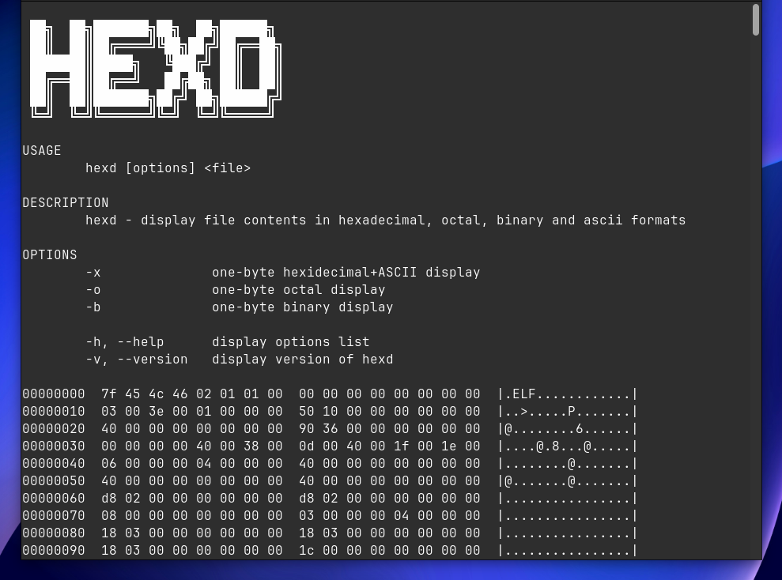

# hexd
**hexd** - tool for displaying file contents in hexadecimal, octal, binary and ascii formats.
> **It has some options like in hexdump. I added the functions that I use and also added option to display file content in binary+ASCII format. (For learning / personal purposes)**      |




## Installation
First clone this repository:
```console
git clone https://github.com/alkuzin/hexd.git
```
Then run those commands (you need be **root** to move executable to **bin/** directory):
```console
make all && make clean
```
*(Optional)* If you want to use it in anywhere, copy the executable 
into the **/usr/bin/** directory **(root rights required)**:
```console
sudo cp ./hexd /usr/bin/
```

To get list of options run this command:
```
hexd --help
```