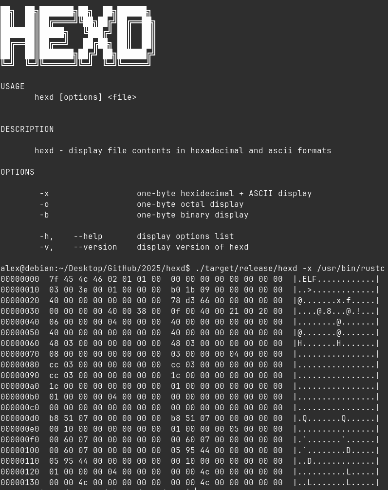

# hexd
**hexd** - tool for displaying file contents in hexadecimal, octal, binary and ascii formats.



## Installation
First clone this repository:
```console
git clone https://github.com/alkuzin/hexd.git
```

Build the project:
```console
cargo build --release
```

To get list of options run this command:
```
cargo run --release -- --help
```